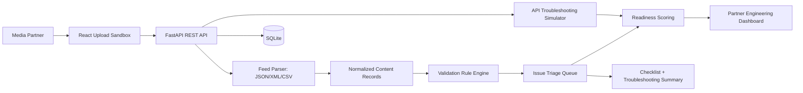

# StreamBridge: TV Partner Onboarding and Integration Console

StreamBridge is a production-style partner engineering platform for onboarding TV channels and premium content partners into a streaming service. It validates incoming JSON, XML, and CSV partner feeds, surfaces launch blockers, simulates partner API health checks, calculates launch-readiness scores, and generates partner-facing integration guidance.

## Problem Statement

Media partners often submit metadata, artwork, availability windows, captions, playback URLs, and entitlement rules in inconsistent formats. Operations teams then review feeds manually, which slows launches and makes it harder to identify whether blockers come from metadata, artwork, regional availability, playback, API failures, captions, DRM, entitlement packages, or partner configuration gaps.

StreamBridge turns that manual review into a repeatable engineering workflow for partner engineers, media partners, and operations managers.

## Why This Matters for Partner Engineering

- Gives partner engineers one place to inspect integration health, feed quality, launch blockers, API failures, and readiness.
- Gives media partners a sandbox to upload sample feeds, review validation errors, and download launch guidance.
- Gives operations managers dense triage views for SLA aging, severity, category, owner, partner status, and recurring issue trends.

## Architecture



## Tech Stack

- Frontend: React, TypeScript, Vite, Tailwind CSS, Recharts, lucide-react
- Backend: FastAPI, Python, Pydantic, SQLAlchemy
- Database: SQLite for local development
- Parsing: pandas for CSV, Python json, ElementTree for XML
- Testing: pytest, FastAPI TestClient
- Tooling: Docker, Docker Compose, GitHub Actions CI

## Data Model

Core tables include `partners`, `feed_uploads`, `content_items`, `artwork_assets`, `availability_windows`, `captions`, `entitlement_rules`, `api_checks`, `validation_errors`, `readiness_scores`, and `onboarding_tasks`.

The seed script creates a realistic local dataset:

- 8 media partners
- 25 feed uploads
- 400 content items
- 150 artwork assets
- 300 availability windows
- 100 caption records
- 80 entitlement rules
- 200 validation errors
- 60 API checks
- 8 readiness scores
- 40 onboarding tasks

## Validation Rules

The rule engine validates missing titles, missing or duplicate content IDs, invalid series/season/episode hierarchy, missing channel IDs, invalid availability dates, unsupported regions, missing languages and ratings, required captions, missing artwork, invalid artwork dimensions, unsupported artwork file types, missing or invalid playback URLs, missing DRM flags, missing premium entitlement packages, package/region mismatches, parser failures, and unsupported metadata formats.

## Readiness Scoring

Readiness combines:

- Critical and high blocker counts
- Valid content percentage
- Artwork completion
- Premium entitlement completion
- API health and latency
- SLA aging penalties

Scores are capped from 0 to 100 and automatically update partner integration status for Draft, Testing, Blocked, Ready, and Live workflows.

## API Endpoints

- `GET /api/partners`
- `POST /api/partners`
- `GET /api/partners/{partner_id}`
- `POST /api/feeds/upload`
- `POST /api/feeds/{feed_id}/parse`
- `POST /api/feeds/{feed_id}/validate`
- `GET /api/feeds/{feed_id}/errors`
- `GET /api/partners/{partner_id}/readiness`
- `GET /api/issues/triage`
- `PATCH /api/issues/{issue_id}`
- `POST /api/api-checks/run/{partner_id}`
- `GET /api/api-checks/{partner_id}`
- `GET /api/dashboard/summary`
- `GET /api/reports/product-feedback`
- `GET /api/partners/{partner_id}/integration-checklist`
- `GET /api/partners/{partner_id}/troubleshooting-summary`

FastAPI also exposes OpenAPI docs at `http://127.0.0.1:8000/docs`.

## Dashboard Screenshots

Run the app locally and capture:

- Dashboard: readiness cards, blocker trend, issue mix, partner launch board
- Feed Upload Sandbox: JSON/XML/CSV upload, parser result, validation summary
- Issue Triage: severity/category/status filters and owner workflow
- API Troubleshooting: endpoint status, latency history, retry simulation
- Readiness Report: launch score, checklist, generated troubleshooting summary
- Product Feedback: recurring issue trends and recommended self-service improvements

## How to Run Backend

```bash
cd backend
python -m venv .venv
.venv\Scripts\activate
pip install -r requirements.txt
python -m app.seed
uvicorn app.main:app --reload --host 127.0.0.1 --port 8000
```

The backend auto-seeds the SQLite database on first startup if no partners exist.

## How to Run Frontend

```bash
cd frontend
npm install
npm run dev
```

Open `http://127.0.0.1:5173`.

## How to Run Tests

```bash
cd backend
pytest
```

```bash
cd frontend
npm run build
```

## Deployment Instructions

Local Docker:

```bash
docker compose up --build
```

Production notes:

- Replace SQLite with PostgreSQL for concurrent writes and durable launch history.
- Put uploaded feeds in object storage such as S3 or GCS.
- Add authentication and partner-level authorization before exposing partner uploads externally.
- Configure CORS to the deployed frontend origin only.
- Add background jobs for large feed ingestion and retryable API checks.

## Future Improvements

- Partner-specific schema templates for live sports, premium movies, kids, news, and international channel feeds.
- Real OAuth/API contract testing against partner staging endpoints.
- Diff view between feed versions.
- Partner-facing comments and issue assignment.
- Automated launch approval workflow with audit history.
- Optional LLM integration for richer troubleshooting summaries.

## Resume Bullet Bank

1. Built StreamBridge, a TV partner onboarding and integration console using React, TypeScript, FastAPI, SQL, and JSON/XML/CSV validation to ingest partner feeds, detect metadata, availability, artwork, playback, API, and entitlement issues, and generate launch-readiness scores.

2. Designed REST APIs, validation rules, readiness scoring, issue triage dashboards, and partner-facing documentation workflows across 400 synthetic content records, converting manual feed review into a scalable partner-engineering workflow.

3. Implemented API troubleshooting simulations, SLA aging, recurring issue analytics, and LLM-style partner summaries to help operations, product, and engineering teams identify integration blockers and improve self-service tooling.

