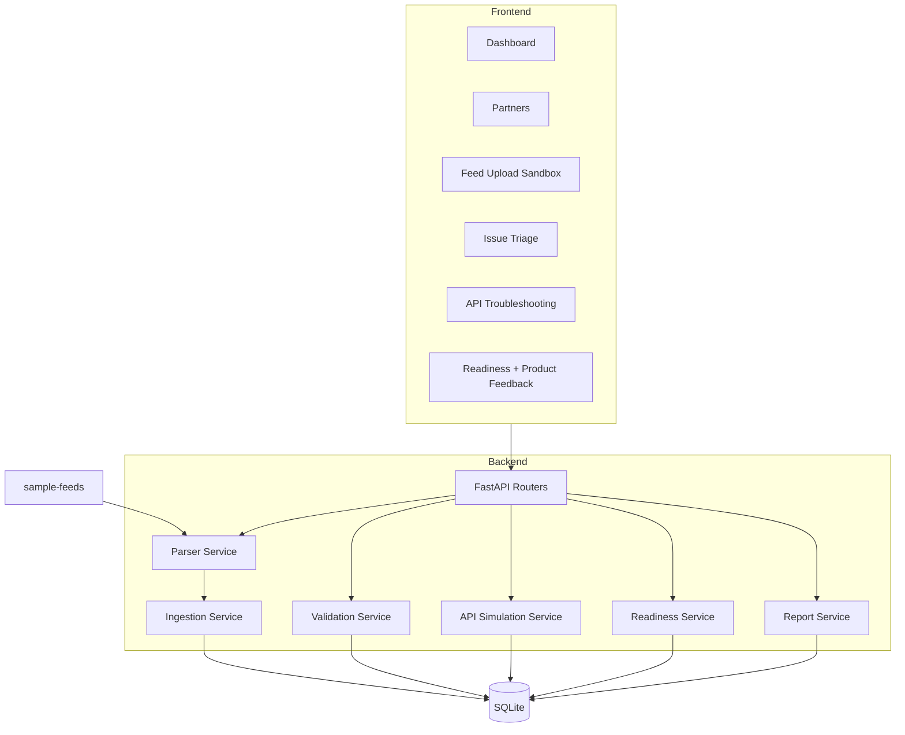

# Architecture

StreamBridge uses a React/Vite frontend and FastAPI backend over a local SQLite database. The backend owns ingestion, parsing, validation, readiness scoring, API troubleshooting simulation, reporting, and seed-data generation.

## Backend Layers

- `app/models.py`: SQLAlchemy models matching the requested database schema.
- `app/services/parser.py`: JSON/XML/CSV parsing and normalization.
- `app/services/ingestion.py`: normalized content persistence.
- `app/services/validation.py`: launch-blocker rule engine.
- `app/services/readiness.py`: readiness scoring and status updates.
- `app/services/api_simulation.py`: partner API check simulation.
- `app/services/reports.py`: checklist, troubleshooting, and product feedback reports.
- `app/routers/*`: REST endpoints used by the frontend.

## Frontend Layers

- `src/App.tsx`: app shell and routing.
- `src/lib/api.ts`: typed REST client.
- `src/components/*`: reusable panels, badges, loading/error states, metric cards.
- `src/pages/*`: dashboard, partners, sandbox, triage, API troubleshooting, readiness, and feedback views.

